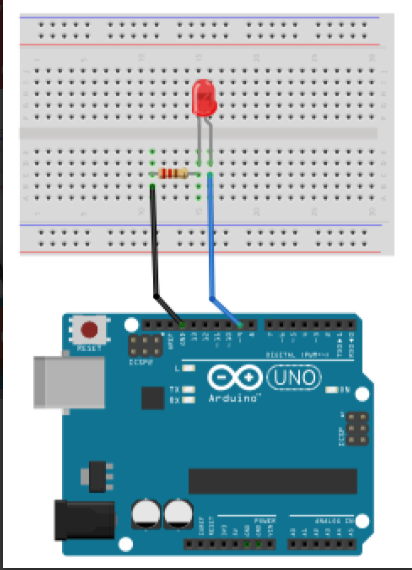

# BasicArduino
 The follwing files are my second foray into Arduino
 
 
## Table of Contents
* [Table of Contents](#TableOfContents)
* [LED_Fade](#LED_Fade)
* [HelloFunctions](#HelloFunctions)
* [NewPing](#NewPing)
---

## LED_Fade

### Description & Code
 Instead of just blinking, you can make the led slowly change brightness, causing it to fade. 


```C++
//Ellen Lynch
//November 18, 2020
//This code makes the led fade. 

// the loop routine runs over and over again forever:
void loop() {
  // set the brightness of pin 9:
  analogWrite(led, brightness);

  // change the brightness for next time through the loop:
  brightness = brightness + fadeAmount;

  // reverse the direction of the fading at the ends of the fade:
  if (brightness <= 0 || brightness >= 255) {
     fadeAmount = -fadeAmount;
     
  }
  
  delay(30);   // wait for 30 milliseconds to see the dimming effect
}
```

Make sure you have a resistor so you don't blow your led. You should only need 2 connector cords. One starts from ground and the other from the pwn pin you want to use. (I used 9) Where you plug in your pwn cord put the resistor in the same row. I put my pwn cord in J, 2. My resistor was in G,2 and E,2. I put my ground connector cord in the row above my resistor and pwn cord. Mine was in D,1. Put the led's long leg, the positive one, in the same row as the resistor, and the short leg, negative one, in the same row as your ground connector cord. For me long leg A,2 and short leg A,1. 


### Evidence
[LED Fade on Arduino Create](https://create.arduino.cc/editor/helmstk1/9e044cca-43d7-4d93-885f-e6dec5b4f769/preview)

### Images 

Credit to [magiceco](https://fritzing.org/projects/led-fade-by-magiceco)

### Reflection
Fading is different than blinking an led because the brightness is going from the minimum to maximum (0-255) in incrememnts of 5 and repeats. The higher the delay number is, the longer the fade will take and it will look less like a fade and more like the led is just lighting up and then sometimes going out. If you're struggling, google is your friend. 
## HelloFunctions

### Description & Code
Description goes here

Here's how you make code look like code:

```C++
Code goes here
```
Talk about how the code works, here....

### Evidence
link goes here

### Images
draw it yourself, take a picture, make a fritzing, whatever you want to EFFECTIVELY communicate how its put together.

### Reflection

## NewPing

### Description & Code
Description goes here

Here's how you make code look like code:

```C++
Code goes here
```
Talk about how the code works, here....

### Evidence
link goes here

### Images
draw it yourself, take a picture, make a fritzing, whatever you want to EFFECTIVELY communicate how its put together.

### Reflection

