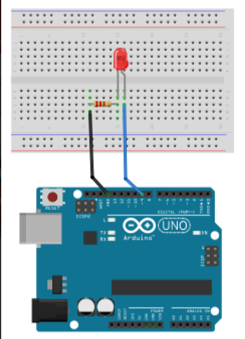
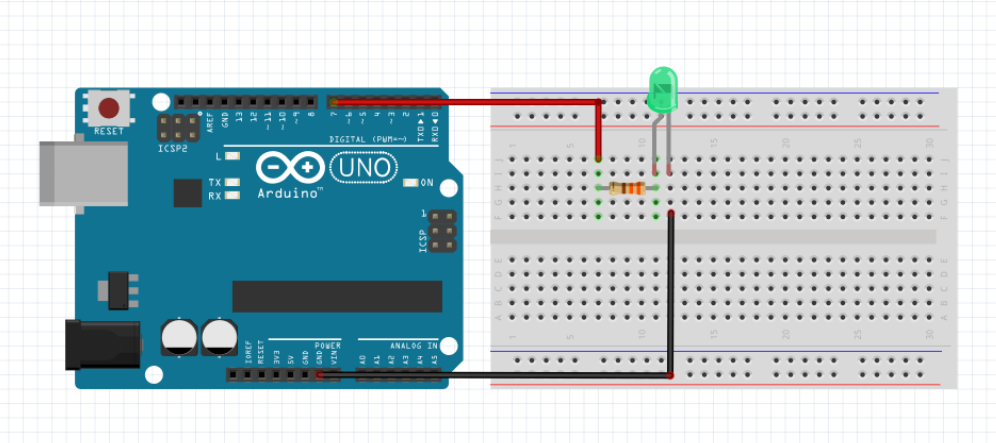
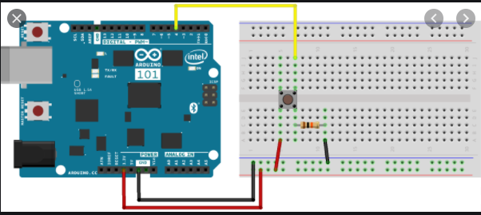

# BasicArduino
 The follwing files are my second foray into Arduino
 
 
## Table of Contents
* [Table of Contents](#TableOfContents)
* [LED_Fade](#LED_Fade)
* [Finite Led](#Finite_Led)
* [Arduino Review](#Arduino_Review)
* [HelloFunctions](#HelloFunctions)
* [NewPing](#NewPing)
---

## LED_Fade

### Description & Code
 Instead of just blinking, you can make the led slowly change brightness, causing it to fade. 


```C++
//Ellen Lynch
//November 18, 2020
//This code makes the led fade. 

// the loop routine runs over and over again forever:
void loop() {
  // set the brightness of pin 9:
  analogWrite(led, brightness);

  // change the brightness for next time through the loop:
  brightness = brightness + fadeAmount;

  // reverse the direction of the fading at the ends of the fade:
  if (brightness <= 0 || brightness >= 255) {
     fadeAmount = -fadeAmount;
     
  }
  
  delay(30);   // wait for 30 milliseconds to see the dimming effect
}
```

Make sure you have a resistor so you don't blow your led. You should only need 2 connector cords. One starts from ground and the other from the pwn pin you want to use. (I used 9) Where you plug in your pwn cord put the resistor in the same row. I put my pwn cord in J, 2. My resistor was in G,2 and E,2. I put my ground connector cord in the row above my resistor and pwn cord. Mine was in D,1. Put the led's long leg, the positive one, in the same row as the resistor, and the short leg, negative one, in the same row as your ground connector cord. For me long leg A,2 and short leg A,1. 


### Evidence
[LED Fade on Arduino Create](https://create.arduino.cc/editor/helmstk1/9e044cca-43d7-4d93-885f-e6dec5b4f769/preview)

### Images 




Credit to [magiceco](https://fritzing.org/projects/led-fade-by-magiceco)

### Reflection
Fading is different than blinking an led because the brightness is going from the minimum to maximum (0-255) in incrememnts of 5 and repeats. The higher the delay number is, the longer the fade will take and it will look less like a fade and more like the led is just lighting up and then sometimes going out. If you're struggling, google is your friend.


## Finite_Led

### Description & Code
Have the breadboard and arduino set up like normal. See the fading assignment if you need help setting it up. All you' re going to do different is that you will be adding restrictions so it doesn' t go forever until you unplug the arduino. The code sets restrictions so that the led can blink only 5 times. 


```C++
int times = 0;
void setup() {
  pinMode(9, OUTPUT);

}

void loop() {
  if (times < 5) {  //this will make it so that when it has blinked 4 times, it will stop. 
    digitalWrite(9, HIGH);
    Serial.println(times);
    delay(250);
    digitalWrite(9, LOW);
    delay(250);
  times++; //This is saying blink one more time than it said and THEN stop. 

  }
}

```
You should know how to control the amount of times an led blinks. When coding this, you need a variable, I used times. The variable can' t be greater than the number of times you want the led to flash. (5) That will make it stop blinking once it has done one less blink than the amount you want. That' s why we add times++ at the end because we want the led to blink one more time than we set it to in the times < 5. 

### Evidence
[Link](https://create.arduino.cc/editor/elynch78/c2e8bac5-0ed3-4234-b540-29a3c01eecb0)

### Images

Credit to Maccattack123

### Reflection
This is the exact same wiring set up as fading, or a normal blinking led. All that is changing is that in the code, we are adding restraints and it can only blink 5 times and then will stop until you run it again. If you still are stuck on how to use an arduino [this can be a good recourse for you to use](https://www.youtube.com/watch?v=CqrQmQqpHXc&feature=emb_title)

## Arduino_Review

### Description & Code
The code creates a "button" that when you plug and unplug the 5V cord will turn on and off the led. You set the ButtonState to 0 so that when you plug in the cord, pushing the button, the energy flows to the led. The if statement makes it so that whe you press the button the led lights up, if it isn't pressed (else) then the led will be dark. 

```C++
int ledPin = 9; //number of the led pin
int buttonState = 0; // variable for reading the button's state
int buttonPin = 7; //the number of the button pin
int delayVar = 1000;

void setup() {
  // initialize the LED pin as an output:
  pinMode(ledPin, OUTPUT);
  // initialize the pushbutton pin as an input:
  pinMode(buttonPin, INPUT);
  Serial.begin(9600);
}

void loop() {
  // read the state of the pushbutton value:
  buttonState = digitalRead(buttonPin);

  // check if the pushbutton is pressed. If it is, the buttonState is HIGH:
  if (buttonState != 0) {
    // turn LED on:
    digitalWrite(ledPin, HIGH);
  } 
  else {
    // if button is not pressed turn LED off:
    digitalWrite(ledPin, LOW);
  }
}
```


### Evidence
[Link](https://create.arduino.cc/editor/elynch78/c2e8bac5-0ed3-4234-b540-29a3c01eecb0)
### Images

### Reflection
The wiring works as a button becase of your code. You need an If, else statement to make it work as a button. That way, If the whole circuit is connected, the wire is in, the led will turn on. But when it isn't plugged in, Else, the led will be off. You use digitalRead so that it registers the input pin being connected. This is important because now when you plug your cord into 5v, it will register you doing so and complete the if statement's actions. [This can give you further information on digitalRead](https://www.arduino.cc/reference/en/language/functions/digital-io/digitalread/) And if you are confused or stuck on the assignment, [this video is very helpful and walks you through it](https://www.youtube.com/watch?v=ksNbEuhO4fU&feature=emb_title) 

## HelloFunctions

### Description & Code

### Evidence

### Images

### Reflection


### Description & Code
Description goes here

Here's how you make code look like code:

```C++
Code goes here
```
Talk about how the code works, here....

### Evidence
link goes here

### Images
draw it yourself, take a picture, make a fritzing, whatever you want to EFFECTIVELY communicate how its put together.

### Reflection

